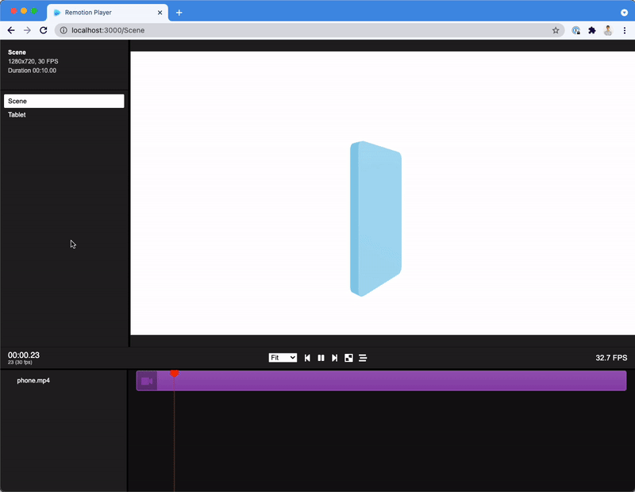

# Remotions Video — AI-Assisted Video Production Studio

Programmatic video production pipeline for **[Yupcha](https://yupcha.com)** (agentic hiring platform) and **[ResuBird](https://resubird.com)** (AI resume analyzer) — built with [Remotion](https://remotion.dev), React, and AI coding agents.

> **15+ marketing videos** shipped from this repo — promos, shorts, brand films, explainers — all generated as code, voiced with AI, and rendered to MP4.

<p align="center">
    
</p>

---

## Quick Start

```bash
# 1. Install dependencies
bun install

# 2. Launch Remotion Studio (visual preview + timeline)
bun run dev

# 3. Render a specific composition to MP4
bunx remotion render <CompositionId>

# Example: render the Interval brand film
bunx remotion render Interval
```

---

## Video Catalog

All rendered outputs land in `out/`. Current compositions:

### Yupcha (dark cinematic theme)

| Composition | Type | Resolution | Description |
|---|---|---|---|
| `YupchaPromo` | Promo | 1920×1080 | Full product promo — agent dashboard, voice AI, anti-cheat |
| `InterviewerDeepDive` | Explainer | 1920×1080 | Deep dive into the AI interviewer capabilities |
| `YupchaManifesto` | Brand | 1920×1080 | Manifesto-style brand film |
| `YupchaVoiceTeaser` | Teaser | 1920×1080 | Voice AI teaser with conversational demo |
| `YupchaScreensAll` | Showcase | 1080×1920 | Vertical product screens walkthrough |
| `Interval` | Brand Film | 1920×1080 | A24-style trailer — "The machine is listening" |
| `ProveYoureReal` | Short | 1080×1920 | Anti-cheat hook — crossover with ResuBird |

### ResuBird (warm cream/orange theme)

| Composition | Type | Resolution | Description |
|---|---|---|---|
| `ResubirdPromo` | Promo | 1920×1080 | Full product promo — analyzer, builder, ATS |
| `ResubirdShort` | Short | 1080×1920 | ATS explainer vertical short |
| `ResubirdGhosted` | Short | 1080×1920 | "Why recruiters ghost you" — ATS terminal HUD |
| `ResubirdResumeRace` | Short | 1080×1920 | Kinetic funnel race — A rejected, B gets offer |
| `ResubirdGlowUp` | Short | 1080×1920 | Before/after resume transformation |
| `ResubirdGlowUpPM` | Short | 1080×1920 | GlowUp variant — Product Manager |
| `ResubirdGlowUpData` | Short | 1080×1920 | GlowUp variant — Data Analyst |
| `ResubirdGlowUpDesign` | Short | 1080×1920 | GlowUp variant — Designer |

---

## Project Structure

```
remotions-video/
├── src/
│   ├── Root.tsx                    # All compositions registered here
│   ├── promo/                      # ← Video components live here
│   │   ├── Interval.tsx            # Brand film (A24-style trailer)
│   │   ├── InterviewerDeepDive.tsx # AI interviewer explainer
│   │   ├── Manifesto.tsx           # Brand manifesto
│   │   ├── ProveReal.tsx           # Anti-cheat crossover short
│   │   ├── VoiceTeaser.tsx         # Voice AI teaser
│   │   ├── YupchaPromo.tsx         # Main Yupcha promo
│   │   ├── YupchaScreens.tsx       # Product screens showcase
│   │   ├── Soundtrack.tsx          # Shared music/audio component
│   │   ├── scenes.tsx              # Shared scene building blocks
│   │   ├── ui.tsx                  # Shared UI primitives (text, badges, etc.)
│   │   ├── theme.ts                # Yupcha color/font tokens
│   │   └── resubird/               # ResuBird-specific videos
│   │       ├── Ghosted.tsx
│   │       ├── GlowUp.tsx
│   │       ├── ResubirdPromo.tsx
│   │       ├── ResumeRace.tsx
│   │       ├── ShortAts.tsx
│   │       ├── scenes.tsx
│   │       ├── ui.tsx
│   │       └── theme.ts            # ResuBird color/font tokens
│   └── helpers/                    # Utility functions
├── public/
│   ├── audio/                      # All VO clips + music beds
│   │   ├── sfx/                    # SFX kit (blip, boom, whoosh, etc.)
│   │   ├── ncs-sky-high.mp3        # Instrumental bed (safe under narration)
│   │   ├── ncs-feel-good.mp3       # Has vocals — avoid under narration
│   │   ├── iv*.wav                 # INTERVAL voice-over clips
│   │   ├── vo*.wav                 # Yupcha promo VO
│   │   ├── rvo*.wav                # ResuBird promo VO
│   │   └── ...                     # Other VO sets (gh*, pr*, race*, etc.)
│   ├── yupcha/                     # Yupcha brand assets (logo, screenshots, hero.mp4)
│   └── resubird/                   # ResuBird brand assets (product videos, favicon)
├── docs/
│   └── BRAND_RESEARCH.md           # Source of truth for product copy & stats
├── out/                            # Rendered MP4s (git-ignored)
├── CLAUDE.md                       # AI agent working rules
└── remotion.config.ts              # Remotion renderer settings
```

---

## AI-Assisted Workflow — How to Use This for Best Results

This repo is designed to be driven by AI coding agents (Claude Code, Gemini, etc.). Here's the workflow that produced all 15+ videos:

### 1. Brand Research First

Before creating any video, the AI reads [`docs/BRAND_RESEARCH.md`](docs/BRAND_RESEARCH.md) — the **single source of truth** for product copy, stats, and brand voice. This prevents hallucinated marketing claims.

**Rule:** Never invent product stats or features. Use the verbatim copy bank in `BRAND_RESEARCH.md`, or mark claims as "example" if unverified.

### 2. Describe the Video You Want

Give the AI a clear creative brief. Best results come from:

```
Make a 60-second vertical short for ResuBird.
Hook: "Your resume gets rejected in 7 seconds."
Show the ATS pipeline (upload → parse → optimize).
End with CTA. Warm orange theme. Energetic female VO.
```

**What works well:**
- Reference an existing composition as a style guide (e.g., "like Ghosted but for Yupcha")
- Specify format: promo (1920×1080) vs short (1080×1920)
- Mention tone: cinematic / energetic / educational
- Call out specific product features to highlight

### 3. Scene-Based Architecture

Each video is a sequence of timed scenes using Remotion's `<Sequence>` and `<AbsoluteFill>`. The pattern:

```tsx
// Each scene is a time-boxed segment
<Sequence from={0} durationInFrames={90}>
  <TitleCard text="The Future of Hiring" />
</Sequence>
<Sequence from={90} durationInFrames={120}>
  <ProductDemo screenshot="dashboard.webp" />
</Sequence>
```

**Best practices:**
- Use `staticFile()` for all assets in `public/`
- Use `useCurrentFrame()` + `interpolate()` for animations
- Use `<Audio>` with `startFrom` for precise VO placement
- Keep scenes in separate functions or components for easy reordering
- Export `DURATION` constants so `Root.tsx` stays in sync

### 4. Voice-Over Pipeline (OmniVoice)

VO is generated via a local OmniVoice server, then placed by measured duration.

```bash
# Start OmniVoice backend (required for VO generation)
cd ~/Desktop/github/OmniVoice
.venv/bin/python -m uvicorn backend.main:app --host 127.0.0.1 --port 3900
```

**Voice profiles used in this project:**
| Profile | Character | Best For |
|---|---|---|
| Helpdesk (`fd085cf0`) | Calm, professional | Explainers, product demos |
| The Luxe (`feat_20_the_luxe`) | Cinematic, deep | Brand films, trailers |
| The Upbeat | Energetic, female, American | Marketing, social ads |

**Post-processing chain for premium feel:**
1. `loudnorm I=-14` — normalize loudness
2. De-ess (tame harsh highs)
3. Low-end warmth boost
4. Gentle compression
5. Slight speed reduction for polish (without killing energy)

**Placement rule:** Measure each clip's actual duration, then set `startFrom` cues so VO clips never overlap. Don't assume durations — always measure.

### 5. Music & SFX

| Asset | Notes |
|---|---|
| `ncs-sky-high.mp3` | ✅ Clean instrumental — safe under narration |
| `ncs-feel-good.mp3` | ⚠️ Has vocals — don't layer under VO |
| `public/audio/sfx/` | UI sounds: blip, boom, whoosh, riser, pulse, tick, error, success |

**Music bed tips:**
- Keep bed volume at 10–15% under narration
- Use `<Audio volume={0.12}>` for background beds
- SFX should punctuate transitions, not play continuously

### 6. Rendering

```bash
# Render a single composition
bunx remotion render Interval

# Render with specific output path
bunx remotion render Interval --output out/interval-final.mp4

# Preview specific composition in studio
bun run dev
# → Select composition from sidebar in browser
```

**Config notes** (`remotion.config.ts`):
- OpenGL renderer set to `angle` (for 3D compositions with React Three Fiber)
- Image format set to `jpeg` (faster renders)

### 7. Iteration Loop

The AI workflow that produced the best results:

1. **Describe** → Tell the AI what video you want (tone, length, format, features to highlight)
2. **Generate** → AI creates the composition + VO clips
3. **Preview** → Check in Remotion Studio (`bun run dev`)
4. **Refine** → "Make the voice softer" / "Add more energy" / "Swap the music bed"
5. **Render** → `bunx remotion render <id>`

**Iteration tips that saved time:**
- "Verify with stills before full render" — screenshot frames to check layout before a 3-minute render
- Use `OffthreadVideo` cautiously — it can be unreliable; prefer static images when possible
- Ask for VO re-generation in a specific profile rather than trying to pitch-shift
- One strategic question > five options. Tell the AI to pick the best path and explain why.

---

## Theme System

Two brand themes are defined and enforced across all compositions:

### Yupcha (`src/promo/theme.ts`)
```
Background: #040816 (dark navy void)
Blue: #4286f5 | Green: #0f9d58 | Yellow: #f4b400 | Red: #db4437
Fonts: Space Grotesk (display), Inter (body), JetBrains Mono (code)
```

### ResuBird (`src/promo/resubird/theme.ts`)
```
Primary: #F97316 (orange) | Amber: #DE9D5A | Cream: #FDF4E7 | Ink: #1C1917
```

---

## Adding a New Video

1. **Create** a new `.tsx` file in `src/promo/` (or `src/promo/resubird/` for ResuBird)
2. **Export** the component and a `DURATION` constant
3. **Register** it as a `<Composition>` in `src/Root.tsx`
4. **Use** the appropriate theme tokens — don't ad-hoc colors
5. **Place** VO clips in `public/audio/` with a consistent prefix
6. **Ground** all copy in `docs/BRAND_RESEARCH.md`

---

## Working Rules for AI Agents

See [`CLAUDE.md`](CLAUDE.md) for the full set of rules that produce the best output. Key principles:

- **Open strategic, not literal** — state what matters before executing
- **Recommend, don't enumerate** — pick the best path, explain why
- **No AI prose** — ground all product claims in `BRAND_RESEARCH.md`
- **Be surgical** — short sentences, no preamble, show don't narrate
- **VO pipeline** — generate → loudnorm → place by measured duration (no overlap)
- **Verify with stills** before full render

---

## Commands Reference

| Command | What it does |
|---|---|
| `bun install` | Install dependencies |
| `bun run dev` | Launch Remotion Studio (preview + timeline) |
| `bunx remotion render <id>` | Render a composition to MP4 |
| `bunx remotion upgrade` | Upgrade Remotion to latest |
| `bun run lint` | Run ESLint + TypeScript checks |

---

## Tech Stack

- **[Remotion](https://remotion.dev)** v4.0 — React-based video renderer
- **[React Three Fiber](https://docs.pmnd.rs/react-three-fiber)** — 3D compositions
- **TypeScript** — type-safe video components
- **OmniVoice** — Local AI voice-over generation
- **Bun** — Package manager & runtime

## License

See [LICENSE.md](LICENSE.md).
